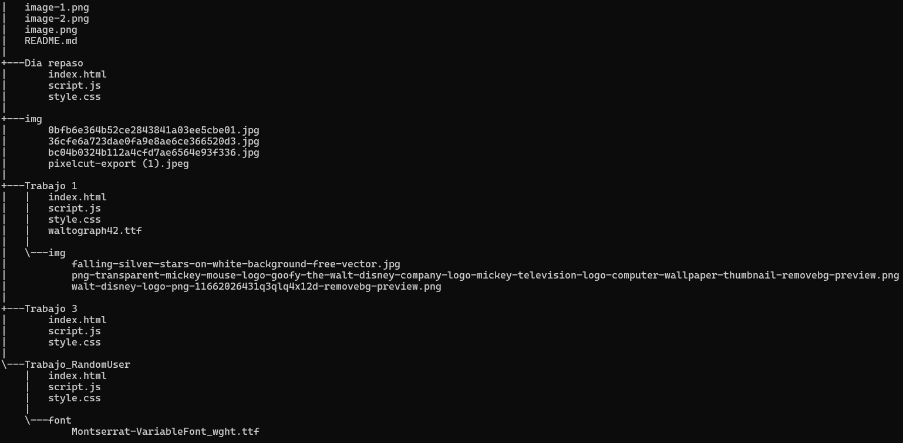

# Trabajos de repaso

## Descripción

En este repositorio encontrarás los trabajos asignados como refuerzos en los temas vistos.

## Tecnologías utilizadas

|JavaScript|HTML5|CSS3|
|-|-|-|
||||

## Estructura

## Características

|Nombre|Descripción|
|-|-|
|Archivos **index**|En estos se encuentra la estructura o maquetación de los aplicativos creados.|
|Archivos **Style**|Estos contienen todo lo relacionado con la parte visual y el diseño como colores y maquetaciones.|
|Archivos **Script**|Estos contienen todo el código para darle funcionalidad a los aplicativos creados, algunos de estos también pueden tener estructuración del diseño realizado.|
|Carpetas **img**|Contienen las imágenes utilizadas para la realización de los aplicativos.|

## Instrucciones

**1.** Clonar el repositorio cargado en GitHub.

**2.** Abrir una de las carpetas y buscar el archivo **index**.

**3.** Ejecutar el archivo con live server.

## Desarrollado por

Los trabajos fueron realizados por Alejandra Machuca, estudiante de CampusLands.